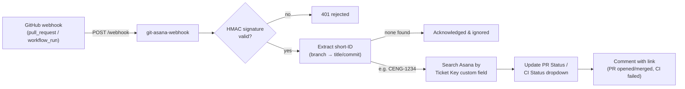

# git-asana-webhook

A stateless, containerized **GitHub → Asana integration** that mimics the native Jira–GitHub experience: pull request and CI activity in GitHub automatically updates the matching Asana task — no database, no polling, no per-seat SaaS.

Teams that use Asana for project management often tag work with Jira-style short-IDs (e.g. `CENG-1234`) in branch names and PR titles. This service catches GitHub webhooks, extracts that short-ID, finds the Asana task whose **Ticket Key** custom field matches, and keeps two dropdown fields — **PR Status** and **CI Status** — in sync, posting comments with links back to GitHub at the moments that matter.

## How it works



1. **Catch & route** — listens for `pull_request` and `workflow_run` events on `/webhook`; every other event is acknowledged and ignored. All deliveries are verified against `X-Hub-Signature-256` (constant-time HMAC-SHA256).
2. **Extract short-ID** — a configurable regex (default `\b[A-Z][A-Z0-9]+-\d+\b`, case-insensitive) scans the branch name first, then the PR title or commit message.
3. **Asana lookup** — the workspace task-search API finds the task whose Ticket Key custom field equals the short-ID.
4. **Execute updates** — dropdown custom fields are set and comments posted per the mapping below.

### Event mapping

**Pull requests → "PR Status" field**

| GitHub event                          | PR Status | Comment posted        |
| ------------------------------------- | --------- | --------------------- |
| `opened`                               | Open      | Yes — link to the PR  |
| `reopened`, `ready_for_review`         | Open      | No                    |
| `closed` (merged)                      | Merged    | Yes — link to the PR  |
| `closed` (not merged)                  | Closed    | No                    |
| any other action                       | ignored   | —                     |

**Workflow runs → "CI Status" field**

| GitHub event                                          | CI Status | Comment posted             |
| ----------------------------------------------------- | --------- | -------------------------- |
| `requested`, `in_progress`                             | Pending   | No                         |
| `completed`: `success`                                 | Passed    | No                         |
| `completed`: `failure`, `timed_out`, `startup_failure` | Failed    | Yes — link to the run      |
| `cancelled`, `skipped`, `neutral`, `stale`             | ignored   | — (never clobbers a state) |

## Project status & roadmap

**Working today**

- Express 5 server with signature verification, health probe, and graceful shutdown
- Typed handlers for `pull_request` / `workflow_run` (via `@octokit/webhooks-types`)
- Zero-dependency Asana client (native `fetch`) with rate-limit backoff
- Multi-stage, non-root Dockerfile ready for Cloud Run / App Runner / Container Apps
- PR smoke tests in CI ([smoke-test.yml](.github/workflows/smoke-test.yml)) that boot the built server and assert on live endpoints

**Planned**

- `terraform/` — an IaC template deploying the container to Google Cloud Run
- `.github/workflows/deploy.yml` — build & push to Google Artifact Registry, deploy to Cloud Run
- Ideas beyond that: `deployment_status` events, configurable comment templates, moving tasks between sections on merge

## Requirements

- An Asana workspace on a **paid plan** (the task-search API used for lookups requires it)
- An Asana **Personal Access Token** (or service-account token)
- Three custom fields available on your tasks:
  - **Ticket Key** — text field holding the short-ID (e.g. `CENG-1234`)
  - **PR Status** — dropdown with options *Open*, *Merged*, *Closed*
  - **CI Status** — dropdown with options *Pending*, *Passed*, *Failed*
- Node.js ≥ 20 (local development) or any container runtime

## Configuration

Everything is supplied via environment variables — see [.env.example](.env.example) for the documented reference.

| Variable | Description |
| --- | --- |
| `PORT` | Listen port (Cloud Run injects this; defaults to `8080`) |
| `GITHUB_WEBHOOK_SECRET` | Shared secret used to verify webhook deliveries |
| `SHORT_ID_PATTERN` | *Optional.* Override regex for short-ID extraction |
| `ASANA_ACCESS_TOKEN` | Asana PAT / service-account token |
| `ASANA_WORKSPACE_GID` | Workspace to search for tasks in |
| `ASANA_TICKET_KEY_FIELD_GID` | Text custom field storing the short-ID |
| `ASANA_PR_STATUS_FIELD_GID` | "PR Status" dropdown field |
| `ASANA_PR_STATUS_OPEN_GID` / `..._MERGED_GID` / `..._CLOSED_GID` | GIDs of the three PR Status options |
| `ASANA_CI_STATUS_FIELD_GID` | "CI Status" dropdown field |
| `ASANA_CI_STATUS_PENDING_GID` / `..._PASSED_GID` / `..._FAILED_GID` | GIDs of the three CI Status options |

### Finding your Asana GIDs

```bash
# Workspaces you can access
curl -s -H "Authorization: Bearer $ASANA_ACCESS_TOKEN" \
  https://app.asana.com/api/1.0/workspaces | jq

# Custom fields on a project, including dropdown option GIDs
curl -s -H "Authorization: Bearer $ASANA_ACCESS_TOKEN" \
  "https://app.asana.com/api/1.0/projects/<project_gid>/custom_field_settings?opt_fields=custom_field.gid,custom_field.name,custom_field.enum_options.gid,custom_field.enum_options.name" | jq
```

### GitHub webhook setup

In your repository (or organization) settings → **Webhooks**:

- **Payload URL:** `https://<your-deployment>/webhook`
- **Content type:** `application/json` (required)
- **Secret:** the same value as `GITHUB_WEBHOOK_SECRET`
- **Events:** select *Pull requests* and *Workflow runs*

## Local development

```bash
npm install
cp .env.example .env      # fill in your values
npm run build
node --env-file=.env dist/index.js
```

For watch mode: `env $(grep -v '^#' .env | xargs) npm run dev`

The CI smoke tests are plain bash + curl and can be dry-run locally — see the `Run smoke tests` step in [smoke-test.yml](.github/workflows/smoke-test.yml).

## Docker

```bash
docker build -t git-asana-webhook .
docker run --rm -p 8080:8080 --env-file .env git-asana-webhook
```

The image is multi-stage (compile → prune → runtime), runs as the non-root `node` user, binds to `$PORT`, and exits cleanly on `SIGTERM` — the contract expected by Google Cloud Run, AWS App Runner, and Azure Container Apps alike. Because the service is stateless, it scales to zero safely; store `GITHUB_WEBHOOK_SECRET` and `ASANA_ACCESS_TOKEN` in your platform's secret manager rather than plain environment config.

## Project structure

```
src/
  index.ts               Express server, /webhook + /healthz endpoints
  config.ts              Env-driven configuration with fail-fast validation
  handlers/github.ts     Event routing and action → status mapping
  asana/client.ts        Typed Asana REST wrapper (search, fields, comments)
  utils/                 Short-ID regex, HMAC verification, JSON logger
.github/
  workflows/smoke-test.yml   PR smoke tests against the built server
  dependabot.yml             npm / Actions / Docker update automation
Dockerfile               Multi-stage, non-root, Cloud Run-ready
.env.example             Documented configuration reference
```

## License

[MIT](LICENSE)
